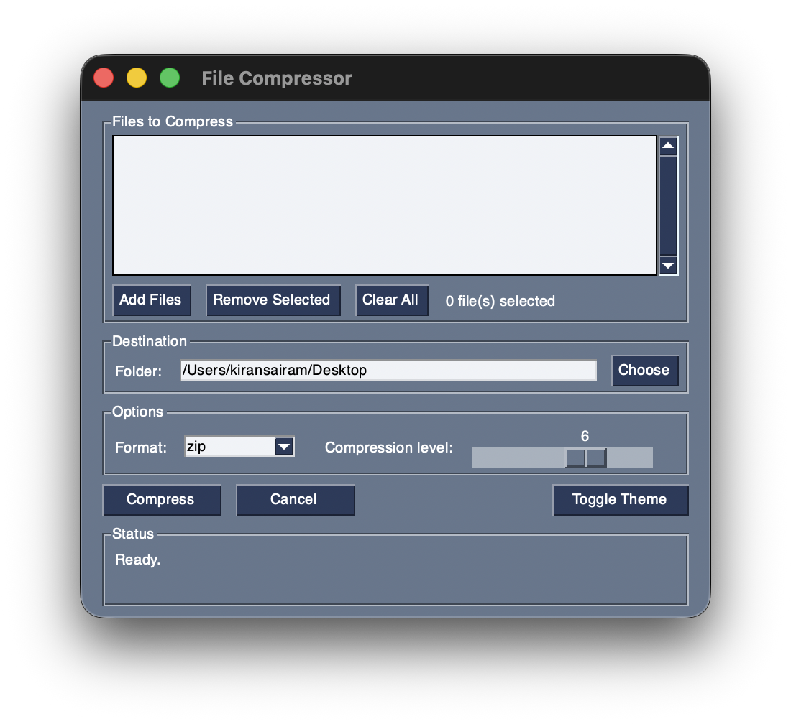

# File Compressor

A lightweight desktop application for compressing files into ZIP or tar.gz archives, built with Python and FreeSimpleGUI.



## Features

- **Multi-file selection** with a listbox interface for adding, removing, and managing files before compression
- **ZIP and tar.gz** archive format support
- **Adjustable compression level** (0–9) via a slider control
- **Compression ratio display** showing original size, compressed size, and percentage saved
- **Threaded compression** keeps the GUI responsive during large operations
- **Cancel support** to abort in-progress compression and clean up partial archives
- **Overwrite protection** with a confirmation dialog when the output file already exists; auto-renames if declined
- **Duplicate basename handling** so files with the same name from different directories are renamed inside the archive instead of overwriting each other
- **Persistent settings** remembering the last-used destination folder and theme preference across sessions
- **Dark/light theme toggle**
- **Full input validation** with clear error messages for missing files, invalid paths, and empty selections

## Project Structure

```
Local-File-Compressor/
├── compressor.py      # GUI frontend (FreeSimpleGUI)
├── zip_creator.py     # Compression backend (zipfile / tarfile)
├── requirements.txt   # Python dependencies
├── screenshot.png     # App screenshot
├── LICENSE            # MIT License
└── README.md
```

### compressor.py (Frontend)

Handles all user interaction: file selection, destination picking, format and compression level options, theme switching, and status display. Compression runs in a background thread and communicates results back to the GUI via FreeSimpleGUI's `write_event_value` mechanism.

### zip_creator.py (Backend)

Provides the `make_archive()` function which accepts a list of file paths, a destination directory, and configuration options, then produces a compressed archive. Fully independent of the GUI and usable as a standalone CLI tool or as an importable module.

## Requirements

- Python 3.8+
- [FreeSimpleGUI](https://github.com/spyoungtech/FreeSimpleGUI)

All other dependencies (`zipfile`, `tarfile`, `pathlib`, `threading`, `json`, `logging`, `argparse`, `os`) are part of the Python standard library.

## Installation

1. Clone the repository:

```bash
git clone https://github.com/Kiran1510/Local-File-Compressor.git
cd Local-File-Compressor
```

2. Install dependencies:

```bash
pip install FreeSimpleGUI
```

Or, if a `requirements.txt` is provided:

```bash
pip install -r requirements.txt
```

## Usage

### GUI Application

```bash
python compressor.py
```

This launches the desktop window. From there:

1. Click **Add Files** to select one or more files via the file dialog.
2. Use **Remove Selected** or **Clear All** to manage the file list.
3. Choose a **destination folder** using the folder browser.
4. Select the archive **format** (ZIP or tar.gz) and adjust the **compression level** slider.
5. Click **Compress**. Progress and results (including compression ratio) are shown in the status bar.
6. Use **Cancel** to abort a running compression.
7. Use **Toggle Theme** to switch between dark and light mode.

### Command-Line Interface

`zip_creator.py` can be used directly from the terminal:

```bash
python zip_creator.py file1.txt file2.pdf file3.csv -d ~/Desktop -f zip -l 6
```

**Arguments:**

| Argument | Description | Default |
|---|---|---|
| `files` | One or more file paths to compress (positional) | Required |
| `-d`, `--dest` | Destination directory | Current directory |
| `-n`, `--name` | Output archive filename | `compressed.zip` |
| `-f`, `--format` | Archive format: `zip` or `tar.gz` | `zip` |
| `-l`, `--level` | Compression level (0 = store only, 9 = maximum) | `6` |
| `--overwrite` | Overwrite existing archive instead of auto-renaming | `False` |

**Examples:**

```bash
# Compress three files into a tar.gz on the desktop
python zip_creator.py report.pdf data.csv image.png -d ~/Desktop -f tar.gz

# Maximum compression with a custom archive name
python zip_creator.py *.log -d /tmp -n logs_backup.zip -l 9

# Overwrite an existing archive
python zip_creator.py notes.txt -d ./output --overwrite
```

## Configuration

The GUI saves user preferences to `~/.file_compressor_config.json`:

```json
{
  "last_folder": "/Users/you/Desktop",
  "theme": "Dark"
}
```

This file is created automatically on first use. Delete it to reset preferences.

## Backend API Reference

### `make_archive()`

```python
from zip_creator import make_archive

result = make_archive(
    filepaths=["file1.txt", "file2.pdf"],
    dest_dir="/output",
    archive_name="backup.zip",   # default: "compressed.zip"
    fmt="zip",                   # "zip" or "tar.gz"
    compress_level=6,            # 0-9
    overwrite=False,             # auto-rename if True
    cancel_event=None,           # threading.Event for cancellation
)
```

**Returns:** a `CompressionResult` object with the following attributes and methods:

| Attribute / Method | Type | Description |
|---|---|---|
| `result.path` | `pathlib.Path` | Full path to the created archive |
| `result.file_count` | `int` | Number of files in the archive |
| `result.original_size` | `int` | Total size of source files in bytes |
| `result.archive_size` | `int` | Size of the output archive in bytes |
| `result.human_archive_size()` | `str` | Archive size formatted (e.g., "1.2 MB") |
| `result.human_original_size()` | `str` | Original size formatted |
| `result.ratio_percent()` | `float` | Percentage of space saved |

**Raises:**

| Exception | Condition |
|---|---|
| `FileNotFoundError` | A source file does not exist |
| `ValueError` | No valid files provided, or unsupported format |
| `OSError` | Invalid destination or disk full |
| `InterruptedError` | Compression cancelled via `cancel_event` |

## License

MIT
